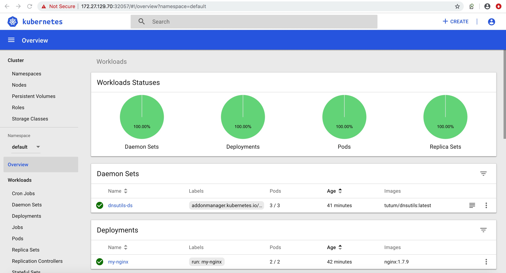

# 使用ansible部署kubernetes

## Dashboard

## 依赖
* `ansible 2.8.5`

## 前提条件（修改下面八个文件的主机名和IP）
* `inventory/hosts`
* `inventory/group_vars/all/all.yml`
* `playbooks/roles/prepare/templates/hosts` 
* `playbooks/roles/etcd/files/etcd-csr.json`
* `playbooks/roles/kube-nginx/templates/kube-nginx.conf`
* `playbooks/roles/controller-manager/files/kube-controller-manager-csr.json`
* `playbooks/roles/kube-scheduler/files/kube-scheduler-csr.json`
* `playbooks/roles/apiserver/files/kubernetes-csr.json`

## 部署集群 (v1.14.2版本的kubernetes)
`ansible-playbook -i inventory/hosts playbooks/site.yml`

##### 需要关注两个点
* 下载kubernetes-server-linux-amd64.tar.gz文件慢的话（playbooks/roles/master），详情见注意事项

* 部署完成后需要登录节点执行（这个需要等待token的csr Approved，所以在ansible的playbooks/roles/kubelet里面就不等待了，最后我们手动执行）
`/opt/k8s/bin/kubectl get csr | grep Pending | awk '{print $1}' | xargs /opt/k8s/bin/kubectl certificate approve`

## 查看集群服务状态
`ansible-playbook -i inventory/hosts playbooks/site.yml --tags "status"`

## 清理集群
在同一套环境里面部署多次的话，可以先清理集群
`ansible-playbook -i inventory/hosts playbooks/clean.yml`

## 注意事项
* `主机名字符串需要符合下面要求 (e.g. 'example.com', regex used for validation is '[a-z0-9]([-a-z0-9]*[a-z0-9])?(\\.[a-z0-9]([-a-z0-9]*[a-z0-9])?)*')`

* `下载kubernetes-server-linux-amd64.tar.gz文件，网速比较慢的话，可以注释掉roles/master/tasks/main.yml，手动先下载上传到节点/opt/k8s/work/路径下`

## 升级内核 (Centos7 自带的内核使用k8s有一些bug)
`ansible-playbook -i inventory/hosts playbooks/kernel.yml`
